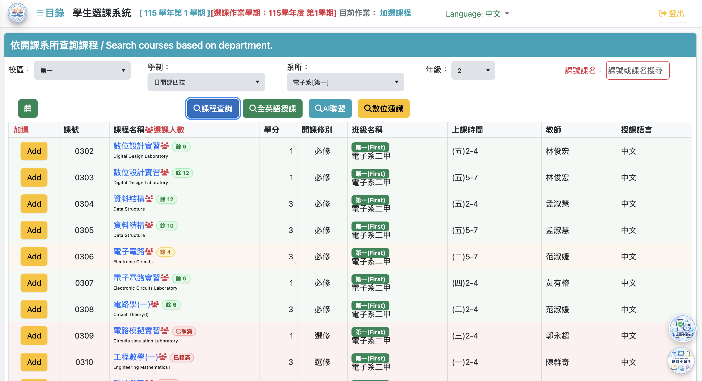
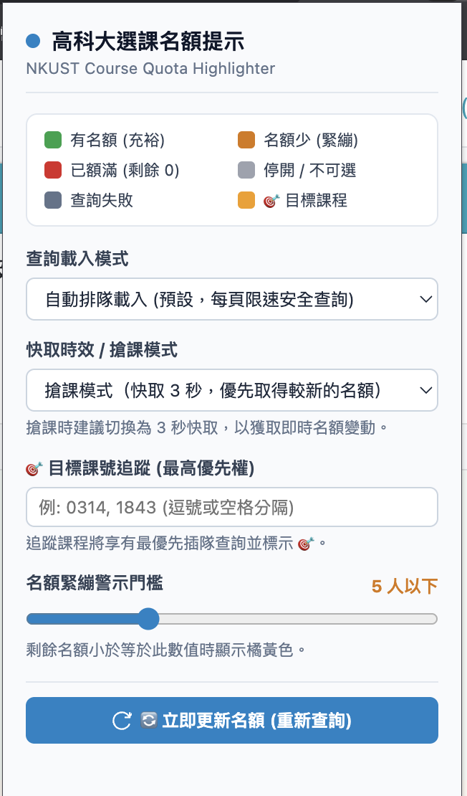

# 高科大選課系統「名額顏色提示」瀏覽器插件

[](https://microsoftedge.microsoft.com/addons/detail/%E9%AB%98%E7%A7%91%E5%A4%A7%E9%81%B8%E8%AA%B2%E7%B3%BB%E7%B5%B1%E5%90%8D%E9%A1%8D%E9%A1%8F%E8%89%B2%E6%8F%90%E7%A4%BA/gkfockcfgkeoifjgaakpgkhlepgkmgjn)


> **NKUST Course Quota Highlighter** (Chrome / Edge Extension - Manifest V3)

本擴充功能專為國立高雄科技大學（NKUST）新版選課系統設計。針對新系統不再直接標記名額狀態、必須逐一點進課程才能確認餘額的痛點，透過安全、非破壞性的方式在課程列表自動還原舊系統的直覺顏色指標與名額標籤，大幅提升選課瀏覽效率。

### 📥 立即安裝
👉 **[Microsoft Edge 擴充功能商店下載](https://microsoftedge.microsoft.com/addons/detail/%E9%AB%98%E7%A7%91%E5%A4%A7%E9%81%B8%E8%AA%B2%E7%B3%BB%E7%B5%B1%E5%90%8D%E9%A1%8D%E9%A1%8F%E8%89%B2%E6%8F%90%E7%A4%BA/gkfockcfgkeoifjgaakpgkhlepgkmgjn)**（一鍵安裝，免手動載入）  
*(Chrome 瀏覽器亦可於上述 Edge 商店頁面點擊「允許來自其他市集的擴充功能」後直接安裝)*

---

## 功能特點

- 🎨 **即時顏色標示**：依據剩餘名額自動為課程列加上綠（充裕）、橘黃（緊繃）、紅（額滿）、灰（停開/不可選）邊框與背景。
- 🔢 **名額徽章**：在課程名稱旁顯示 `[餘 XX]` 或 `[已額滿]` 文字標籤，滑鼠懸停顯示詳細限修、已選、保留人數。
- ⚙️ **彈出視窗設定**：可自訂載入模式（自動/懸停）、快取 TTL 時效（搶課 3 秒/一般 20 秒/節能 60 秒）、目標課號追蹤，以及名額警示門檻。
- 🚀 **安全防護與效能**：
  - 零自動加選，僅在瀏覽器端讀取課程資料，向 NKUST 現有 API 查詢名額，再進行視覺標記。
  - 請求節流防護：最大並發 3 請求，請求間隔 60ms，兼顧載入速度與學校伺服器負載。
  - 視窗可視範圍優先：當前螢幕可見的課程優先排程查詢。
  - 記憶快取與 TTL 時效（Cache TTL）：在快取時效內重複需要資料時直接讀取快取，不重複呼叫 API；時效過期本身不發送請求，隨下一次實際查詢更新。
- 🧩 **非破壞性 UI 注入**：僅透過 CSS class 與內嵌 badge，不改動原網頁結構或樣式。

---

## 視覺提示說明

| 顏色標籤 | 代表狀態 | 判定邏輯 (預設) | 視覺效果 |
| :---: | :---: | :---: | :--- |
| 🟢 **綠色 (Available)** | 剩餘名額充裕 | 剩餘名額 $> 5$ 人 | 左側綠色邊框 (5px)、淡綠背景底色、`[餘 XX]` 徽章 |
| 🟠 **橘黃色 (Low Quota)** | 剩餘名額緊張 | $1 \le \text{剩餘名額} \le 5$ 人 | 左側橘色邊框 (5px)、淡橘背景底色、`[餘 XX]` 徽章 |
| 🔴 **紅色 (Full)** | 名額已額滿 | 剩餘名額 $\le 0$ 人 | 左側紅色邊框 (5px)、淡紅背景底色、`[已額滿]` 徽章 |
| ⚪ **灰色 (Unavailable)** | 停開 / 不可選 | 停開、限修或無名額資訊 | 左側灰色邊框 (5px)、半透明文字、`[不可選]` 徽章 |

> 門檻數值可在擴充功能圖示彈出視窗（Popup）或 `config.js` 中依個人喜好隨時調整。

---

## 實際使用截圖

### 1. 選課清單即時名額與色彩高亮效果
自動在課程名稱旁注入剩餘名額徽章（綠色充裕、橘黃緊張、紅色額滿），並為整列課程加上高識別度色彩邊框與柔和背景底色：



### 2. 擴充功能設定面板 (Popup)
點擊擴充功能圖示即可調整查詢載入模式、快取時效（3 秒搶課模式）、目標課號追蹤，並能隨時手動點擊「🔄 立即更新名額」強制刷新最新資料：

<p align="center">
  
</p>

---

## 專案模組架構

```
nkust-course-highlighter/
├── manifest.json       # Manifest V3 設定檔
├── config.js           # 集中管理所有 DOM Selectors、API 端點、閾值
├── api-service.js      # 請求隊列、限速防抖、快取管理與 HTML 解析器
├── ui-highlighter.js   # 顏色樣式標籤注入與 DOM 渲染模組
├── content.js          # 核心協調器與 MutationObserver 動態監聽
├── styles.css          # 高對比度邊框、柔和底色與名額 Badge 樣式
├── popup/              # 擴充功能設定彈跳視窗
│   ├── popup.html
│   ├── popup.css
│   └── popup.js
├── icons/              # 擴充功能圖示 (16x16, 48x48, 128x128 PNG)
└── images/             # 實際使用截圖展示
```

---

## 安裝方式

### 方法一：商店一鍵安裝（推薦，最簡單）

直接前往 Microsoft Edge Add-ons 擴充功能商店頁面安裝：
* 🔗 **下載連結**：[高科大選課系統名額顏色提示 - Edge Add-ons](https://microsoftedge.microsoft.com/addons/detail/%E9%AB%98%E7%A7%91%E5%A4%A7%E9%81%B8%E8%AA%B2%E7%B3%BB%E7%B5%B1%E5%90%8D%E9%A1%8D%E9%A1%8F%E8%89%B2%E6%8F%90%E7%A4%BA/gkfockcfgkeoifjgaakpgkhlepgkmgjn)
* **Microsoft Edge 使用者**：點擊「取得」按鈕即可完成安裝。
* **Google Chrome 使用者**：進入上方商店頁面後，點擊橫幅「允許來自其他市集的擴充功能」，再點擊「加到 Chrome」即可直接安裝使用。

---

### 方法二：開發者模式手動載入（開發 / 測試用）

#### 步驟 1：開啟瀏覽器擴充功能管理頁面
* **Google Chrome**：在網址列輸入 `chrome://extensions` 並按下 Enter。
* **Microsoft Edge**：在網址列輸入 `edge://extensions` 並按下 Enter。

#### 步驟 2：開啟「開發者模式」
* 在管理頁面右上角（Edge 在左側），將 **「開發者模式」 (Developer mode)** 開關切換為 **開啟**。

#### 步驟 3：載入已解包的擴充功能
1. 點擊左上角的 **「載入未封裝項目」 (Load unpacked)** 按鈕。
2. 在檔案選擇器中，選取本專案目錄（包含 `manifest.json` 的 `nkust-course-highlighter` 資料夾）。
3. 點擊「選取」，即可看到「高科大選課系統名額顏色提示」成功安裝！

---

## 設定說明

點擊瀏覽器工具列的擴充功能圖示開啟設定彈出視窗（Popup），可依需求調整下列參數（設定變更後即時儲存並自動套用至目前分頁，無需重載擴充功能）：

- **查詢載入模式 (`fetchMode`)**
  - `auto` (預設)：自動為當前頁面全部課程排程查詢名額（螢幕可見課程享有較高優先順序）。
  - `hover`：滑鼠移至課程前的人數圖示時才發送請求，最節省伺服器資源與網路頻寬。
- **快取時效 / 搶課模式 (`cacheTTLSec`)**
  - `20 秒` (一般瀏覽，推薦)：名額快取保留 20 秒，適合平時查詢與瀏覽課表。
  - `3 秒` (搶課模式，較快取得最新名額)：快取時效僅 3 秒，快取過期後，下一次查詢會重新向學校 API 取得最新名額。
  - `60 秒` (節能模式)：快取保留 60 秒，大幅減少向學校伺服器請求的次數。
- **🎯 目標課號追蹤 (`targetCourses`)**
  - 輸入關注的課號（如 `0314, 1843`），系統給予最高優先權（插隊最先查詢）並於畫面加上 🎯 專屬外框。
- **名額緊繃警示門檻 (`lowQuotaThreshold`)**
  - 剩餘名額小於或等於此數值時顯示橘黃色警告（預設 5 人以下）。
- **🔄 立即更新名額 按鈕**
  - 主要強制刷新方式。點擊後會立即清空記憶體快取、中斷背景舊請求，並以最高優先級重新查詢當前頁面所有課程名額，同時在頁面右上角顯示非阻擋式的刷新進度指示。

---

## 快取與刷新機制（核心概念）

為兼顧選課搶課的「即時性」與學校伺服器的「穩定防護」，本擴充功能實作了 **Cache TTL（快取存活時間）** 機制。請特別注意其實際行為：

### 1. 「快取秒數」是 Cache TTL，不是自動刷新間隔

> [!IMPORTANT]
> **「3 秒」≠「每 3 秒自動刷新一次畫面」**  
> **「3 秒」＝「快取資料最多視為有效 3 秒」**

* 本擴充功能**絕對不會**在背景無休止地每 3 秒自動發送 API 請求輪詢學校。若無限制地自動定時高頻刷新，極易導致學生個人的 IP 或校務帳號被學校資安系統暫時封鎖，亦會對學校選課伺服器造成無謂的衝擊。
* **快取過期本身不會觸發 API 請求**：快取過期僅代表該筆資料失效，必須等待「下一次實際查詢」被觸發時，才會重新向學校伺服器取得最新名額。
* **MutationObserver 重新掃描不代表一定重新發送 API**：當頁面 DOM 變動觸發重新掃描時，若課程資料仍在有效快取期內，系統會直接沿用快取渲染，絕不重複發送請求；只有沒有有效快取的課程才會發出查詢。
* **「立即更新名額」是目前的主要強制刷新方式**：若需確保當前畫面名額絕對是最新的，請點擊彈出視窗內的「🔄 立即更新名額」。

### 2. 實際運作流程（以設定「3 秒」為例）

* **第 1 次查詢某課程**：
  * 擴充功能向學校 API 發送請求取得最新名額（例如 12 人），並將結果寫入記憶體快取，記錄當前時間戳記。
* **接下來 3 秒內再次需要該課程資訊**：
  * 若觸發重新渲染、DOM 檢查或滑鼠移過，系統會**優先直接使用快取資料**，不重新呼叫學校 API。
* **超過 3 秒後**：
  * 舊快取資料自動被判定為過期失效。
  * **【重要】快取過期本身不會觸發 API**。
* **重新取得最新名額的時機**：
  * 必須等到**下一次實際查詢**被觸發時，系統才會向學校 API 重新取得名額。
  * 常見觸發情境包含：
    1. 點擊彈出視窗內的 **「🔄 立即更新名額」** 按鈕（主要強制刷新方式，會立即清空所有快取、中斷進行中請求並重新查詢當前畫面課程）。
    2. 在選課系統中切換分頁、重新搜尋或變更每頁筆數（**這些操作可能觸發重新掃描；若課程沒有有效快取，才會重新發送查詢**）。
    3. 在 Hover 模式下，滑鼠移至課程的人數圖示上（**若課程沒有有效快取，才會重新發送查詢**）。

### 3. 為何採用此設計？

1. **避免重複請求學校 API**：防止在切換分頁、短時間重複渲染或同一畫面反覆檢查時頻繁呼叫同一端點。
2. **降低學校系統負載**：選課尖峰期間校方伺服器承載龐大流量，快取能防止不必要的請求堵塞通道。
3. **確保需要時能迅速取得新資料**：在熱門課程釋出名額的關鍵階段，設定為 3 秒快取後，只要主動點擊「立即更新名額」或在快取過期後觸發重新掃描，即可確保不會被長達數十秒或數分鐘的舊快取綁住，能夠即時獲取學校端最新異動後的名額。

---

## 常見問題 (FAQ)

### Q1：我切換到「搶課模式（快取 3 秒）」，為什麼名額數字沒有每 3 秒自動跳動一次？
**答**：這是正常的！「快取 3 秒」是 **Cache TTL（資料有效期限）**，而非自動定時刷新器。快取過期本身不會觸發 API。  
若需要獲取最新名額變動，**「立即更新名額」才是目前的主要強制刷新方式**，點擊後會立即重查當前畫面；若在選課系統中切換分頁、重新搜尋或變更每頁筆數，這些操作可能觸發重新掃描；若課程沒有有效快取，才會重新發送查詢。

### Q2：搶課時如何最有效率地掌握最新名額？
**答**：
1. 在彈出視窗將快取時效切換為 **「搶課模式（快取 3 秒，較快取得最新名額）」**。
2. 在 **「🎯 目標課號追蹤」** 填入想選的課號（如 `0314, 1843`）。
3. 關鍵時刻直接點擊彈出視窗下方的 **「🔄 立即更新名額」**。目標課程會自動插隊以最高優先級在最短時間內刷新，並顯示進度條提示。

### Q3：自動模式（auto）與懸停模式（hover）的差別是什麼？
**答**：
* **自動模式 (`auto`)**：進入加選列表後，由擴充功能在背景自動排程查詢，且**螢幕可見的課程列享有較高優先權**。
* **懸停模式 (`hover`)**：完全不主動對整頁發送請求，只有當您將滑鼠移到該課程前方的人數圖示時才單獨發送請求，對網路頻寬與學校伺服器最為輕量。

---

## 開發與貢獻

若您想參與本專案的開發或提出改進建議：

1. Fork 本倉庫。
2. 建立feature branch：`git checkout -b feature/your-feature`
3. 提交變更並推送。
4. 提交 Pull Request，說明您的變更與目的。

> 本專案採用 MIT 授權條款，歡迎自由使用與修改。

---

*最後更新：2026-09-10*
